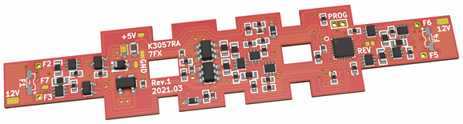

# ATtiny1606 DCC Decoder PCB Data for KATO 3057 PCB Board

NMRA規格の信号を受信して動作する、DCCデコーダの基板設計データです。

KATO製鉄道模型に搭載されている、3057と刻印のある基板と交換して取り付けができます。
 (その他、3010や3023など、形状が同等である他の刻印の基板との交換にも対応できる場合があります。)

  * [基板設計データ](../K3057/KiCad)
  * [面付けデータ](../K3057/KiCad-Panelized)
  * [ガーバーデータ(面付け済)](../K3057/Gerber-Panelized)
  * [メタルマスクデータ(面付け済)](../K3057/Stencil-Panelized)
  
面付け済みのデータについては、elecrowにて製造できることを確認済みです。

## 主要スペック
  * 組み立て後の基板サイズ： 69mm x 14mm x 1.7mm
  * 推奨最大電圧: 16V (搭載する鉄道模型車両の最大電圧以下で使用してください)
  * 出力電流: 最大0.5A (モーター) / 0.1A (ファンクション)
  * コンデンサの搭載や、室内灯電源に対応する+12V / GNDのランドを用意
  * マイコン書き込み用端子を用意し、実装後のプログラム書き換えも可能 UPDI 2pin Interface (GND / UPDI)

## 主な機能
  * モーター制御回路 (BEMF読み取り回路付き)
  * ファンクション出力 x 7 F1-F6は定電流出力、F7は電流制限なし
  * BiDi (Railcom) 送出回路
  * (試験的実装) Asymmetric DCCの認識回路

## ファンクションの割り当て
<table>
  <tr>
    <td>基板上の番号</td>
    <td>ファンクションの推奨割り当て</td>
    <td>電気的特性</td>
  </tr>
  <tr>
    <td>F1</td>
    <td>ヘッドライト (前進)</td>
    <td>定電流出力 (約10mA)</td>
  </tr>
  <tr>
    <td>F2</td>
    <td>テールライト左 (後進/入替灯)</td>
    <td>定電流出力 (約1mA)</td>
  </tr>
  <tr>
    <td>F3</td>
    <td>テールライト右 (後進)</td>
    <td>定電流出力 (約1mA、スルーホール) 定電流出力 (約10mA、裏面パッド)</td>
  </tr>
  <tr>
    <td>F4</td>
    <td>ヘッドライト (後進)</td>
    <td>定電流出力 (約10mA)</td>
  </tr>
  <tr>
    <td>F5</td>
    <td>テールライト左 (前進/入替灯)</td>
    <td>定電流出力 (約1mA)</td>
  </tr>
  <tr>
    <td>F6</td>
    <td>テールライト右 (前進)</td>
    <td>定電流出力 (約1mA、スルーホール) 定電流出力 (約10mA、裏面パッド)</td>
  </tr>
  <tr>
    <td>F7</td>
    <td>キャブライト等、汎用ファンクション</td>
    <td>オープンドレイン (Max50mA程度)</td>
  </tr>
</table>

※ファンクションの推奨割り当ては対応するファームウェアでの初期状態を示しているものであり、ファームウェアを改修したり設定を変更すると変化する場合があります。

## 閲覧・編集に必要なCAD (開発環境)
  * KiCad Version (5.1.9)-1 (またはそれ以降)

### 対応するファームウェア
  * [ATtiny1606 DCC Decoder Firmware](https://github.com/ytsurui/dcc-decoder2-firmware)

### 各種ドキュメント
  * [パーツリスト](partslist-K3057.md)
